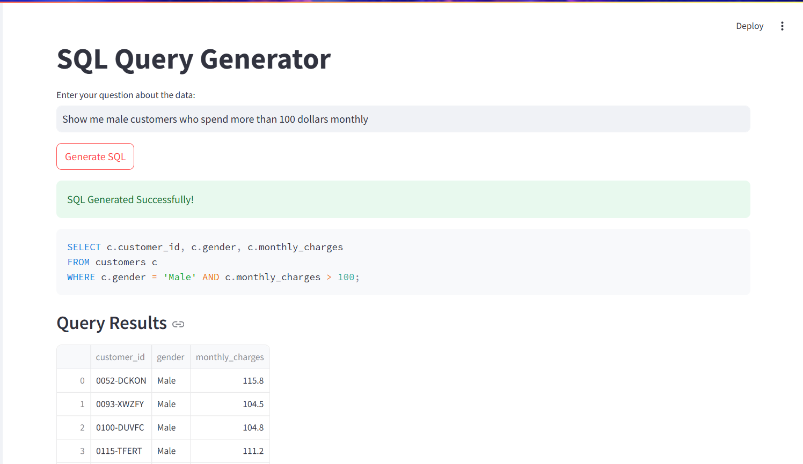

# Customer Telecommunication Churn Prediction

This project is divided into multiple modules, each focusing on a critical aspect of building an end-to-end application for customer churn analysis and prediction. Below is an overview of the modules and their functionalities.

## Modules Overview

### Module 1: Exploratory Data Analysis (EDA)
- **Objective**: Gain insights into the customer telecommunication churn dataset.
- **Tools and Libraries**:
  - `pandas`: Data manipulation and cleaning.
  - `matplotlib` and `seaborn`: Data visualization.
- **Tasks**:
  - Performed detailed exploratory data analysis to understand the dataset structure.
  - Visualized key trends and correlations to identify factors affecting customer churn.

### Module 2: Machine Learning Models
- **Objective**: Build and evaluate predictive models for customer churn.
- **Techniques and Tools**:
  - Algorithms: Support Vector Machines (SVM), Decision Tree, Random Forest.
  - Hyperparameter tuning: Performed using Grid Search.
  - Neural Network: Implemented and tested for performance.
  - Data Augmentation: Applied SMOTE (Synthetic Minority Oversampling Technique) after train-test split to avoid data leakage.
- **Outcome**:
  - Evaluated multiple models and selected the best-performing one (Neural Network).
  - Saved the Neural Network model for inference.

### Module 3: SQL Integration
- **Objective**: Convert the semi-structured dataset into a relational schema for efficient querying.
- **Tools**: MySQL.
- **Tasks**:
  - Designed a relational schema to store customer churn data.
  - Imported the dataset into MySQL for future inferencing.

### Module 4: Backend and Frontend Development
- **Objective**: Build a full-stack application for customer churn prediction.
- **Backend**:
  - Framework: FastAPI.
  - Created various endpoints to support application functionalities.
- **Frontend**:
  - Framework: Streamlit.
  - Developed an interactive user interface to interact with the application.

### Module 5: Bonus - Text2SQL and RAG
- **Objective**: Enhance the application with advanced features.
- **Features**:
  - **Text2SQL**: Transforms natural language input into context-aware SQL queries.
    - Utilized OpenAI's GPT-4 model for natural language processing.
    - Executed SQL queries on the relational database from Module 3.
  - **RAG (Retrieval-Augmented Generation)**: Retrieves top-K related source customers from a vector database.
    - Database: Qdrant.
    - Implemented self-querying to optimize query performance.

## Application Features

The complete application provides the following functionalities accessible from the Streamlit frontend:

1. **Inferencing**:
   - Users can input customer features to predict the likelihood of churn.
   - Outputs the churn probability.
   - 
   - 

2. **Text2SQL**:
   - Accepts natural language queries and generates SQL statements.
   - Executes the SQL query on the relational database and displays results.
   - 

3. **RAG (Retrieval-Augmented Generation)**:
   - Accepts natural language queries to retrieve top-K related customers from the Qdrant vector database.
   - Displays the most relevant customer records.
   - 

